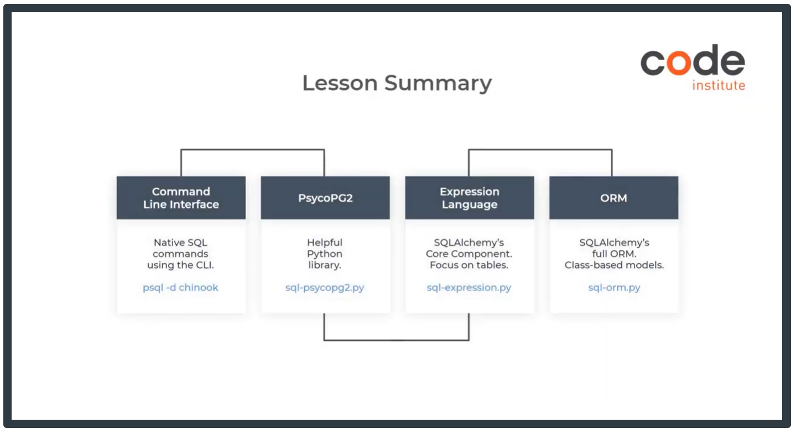

# Chinook database

As part of my Diploma in Full Stack Software Development with Code Institute I've been learning:

- about data, storage of data, Database Management System (DBMS), differences between relational and non-relational databases
- relational databases and various methods to query the database
- how to perform full CRUD functionality using the SQLAlchemy ORM in order to create, read, update, and delete records

